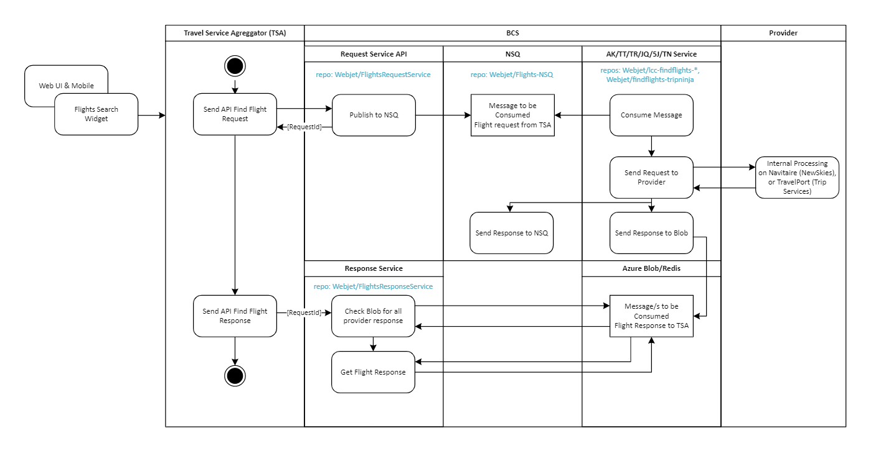

# NSQ Webjet
This is a single project to run all of the NSQ binaries and set up each topic/channel needed by FindFlights Microservices.

## Links
[NSQ](https://nsq.io/overview/quick_start.html)

## Pre-requirements
- Install/Run WSL [WSL](https://learn.microsoft.com/en-us/windows/wsl/install)
- Install/Run Docker inside WSL [Docker](https://docs.docker.com/desktop/windows/wsl/)

## High Level Components Diagram
)

## Commands

```
docker-compose up -d
```

Then open http://localhost:4171, to load NSQAdmin, where you can see cluster stats, and complete administrative tasks.